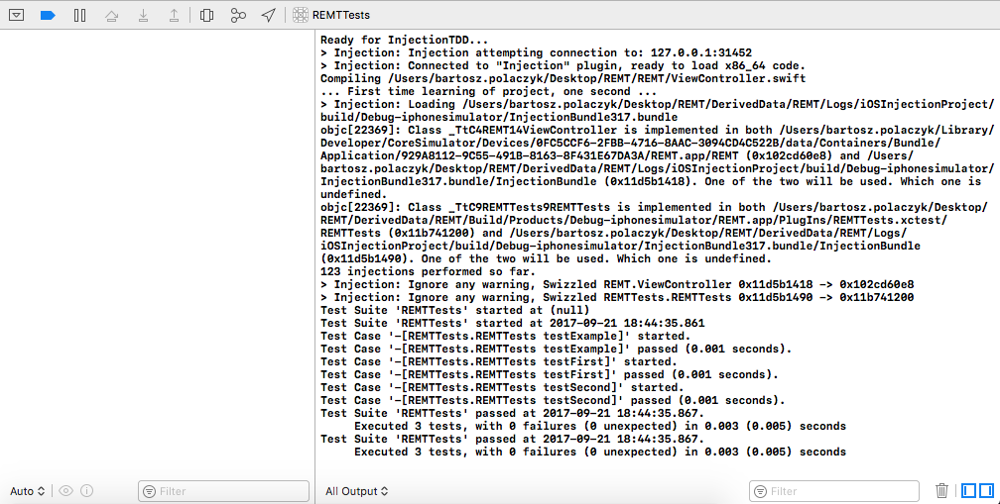

# InjectionTDD

[](https://travis-ci.org/polac24/InjectionTDD)
[](http://cocoapods.org/pods/InjectionTDD)
[](http://cocoapods.org/pods/InjectionTDD)
[](http://cocoapods.org/pods/InjectionTDD)
[](https://github.com/Carthage/Carthage)


# Synopsis

This library triggers Xcode unit tests using [John Holdsworth](https://github.com/johnno1962)'s [injectionforxcode](https://github.com/johnno1962/injectionforxcode) tool.

InjectionTDD immediatelly runs your related unit tests, every time you save implemntation file with ⌘+S.


## Swift version

`InjectionTDD` library is written in Objective-C so it works with any Swift version.

## Requirements

* [injectionforxcode](http://johnholdsworth.com/injection.html) (version with TDD)
* implementation and unit test written in **Swift** (project can be mixed ObjC and Swift)
* Xcode 8 or Xcode 9
* valid global Xcode version using `xcode-select`

### Limitations

* no static libraries (`.a` or static `.framework`) used in a target
* testing target has "Host Application"
* ⌘+⇧+U (or simple ⌘+U)  required when adding new `.swift` file

.

## Installation

### 1. Ensure that you have correctly set global Xcode (`xcode-select`)

1. Call `xcode-select -p`
2. If path does not correspond to your current Xcode version, setup it using command:

```bash
sudo xcode-select -s /Applications/PATH_TO_YOUR_XCODE_VERSION/Contents/Developer
```

### 2. Integrate `InjectionTDD` with your Xcode project:

### - Integration using CocoaPods

InjectionTDD is available through [CocoaPods](http://cocoapods.org).

To install it, simply add the following line to your `Podfile`, **into Tests target :warning:**:

```ruby
...
  target 'REMTTests' do
    # Your test Pods
  
    pod 'InjectionTDD', '~> 0.5'
  end
```

### - Integration using Carthage

Add the following line to the `Cartfile` and link generated .framework library with your **test target**.
```ruby
github "polac24/InjectionTDD"
```

### - Integration with compiled  `.framework`

Add binary framework to your **test target**. You can find compiled framework (`InjectionTDD.framework.zip`) in [releases section](https://github.com/polac24/InjectionTDD/releases).

You can find sample integration on [one approach to integrate binary framework](documentation/Integrate_binary.md).

## How to use it?

1. Run [injectionforxcode](https://github.com/johnno1962/injectionforxcode)
2. After successful  `InjectionTDD` integration with your test target (step 2.), run it (⌘+U) and you will see prompt `Ready for InjectionTDD...`


3. It means that your unit tests wait for injection bundles and will never terminate :white_check_mark:
4. Using [injectionforxcode](https://github.com/johnno1962/injectionforxcode), inject your implementation (e.g. shortcut **⌃+=**)
5. injectionforxcode automatically finds all related tests for your file and execute them
6. On output console you will see summary of all actions and summary of your tests :tada:




6. To get feedback immediatelly after each save with ⌘+S, enable "FileWatcher" in injectionforxcode:


7. You can selectively disable `InjectionTDD` in your schema but adding `INJECTION_TDD_SKIP=TRUE` environment variable in a test action:


## Test Summary Notification

To display notification everytime your test finishes, install extra breakpoints that present a summary of your test suite:


### Summary notifications installation:

**:warning: Remeber to install breakpoints when Xcode is closed, otherwise new breakpoints may not be added**


```bash
mkdir -p /tmp/update_breakpoints_tdd && curl https://codeload.github.com/polac24/InjectionTDD/tar.gz/master | tar -xz --strip=3 --directory /tmp/update_breakpoints_tdd InjectionTDD-master/scripts/update_breakpoints/ && cd /tmp/update_breakpoints_tdd/ && ./update_breakpoints.sh && cd -
```

## Best practicies

1. Keep InjectionTDD integrated all the time (e.g. add it to `Podfile`) and provide two schemas: (1) used for TDD development only, (2) used for CI with disabled InjectionTDD (see [how](#how-to-use-it)). This helps to quickly switch between standard and TDD development.


## Recommendations

* If you want to speed up your injection, disable code coverage. Just unselect "Gather coverage data" in your test scheme when doing TDD: 


## Author

Bartosz Polaczyk, polac24@gmail.com

## Credits

This library is an addition to [John Holdsworth](https://github.com/johnno1962) great tool [injectionforxcode](https://github.com/johnno1962/injectionforxcode). More details about live code injection you will find at [Injection, the App](http://johnholdsworth.com/injection.html) and [@Orta](https://twitter.com/@orta) [video post](http://artsy.github.io/blog/2016/03/05/iOS-Code-Injection/).

## License

InjectionTDD is available under the MIT license. See the [LICENSE](LICENSE) file for more info.
