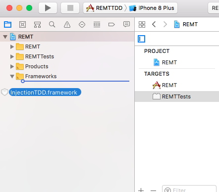
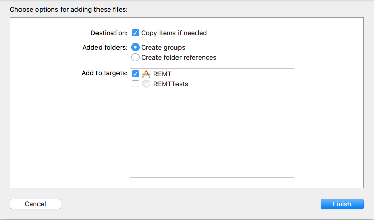
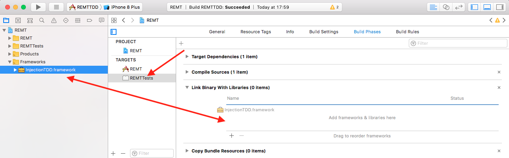
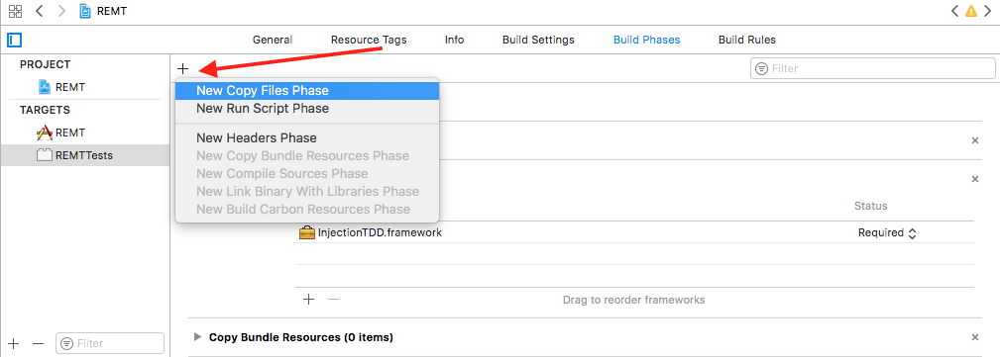
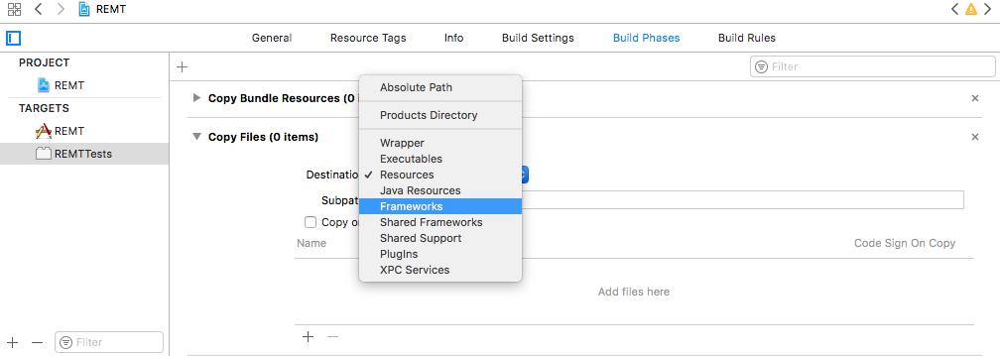
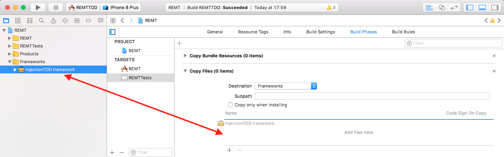

# How to integrate binary framework (one approach)

1. Download last version of compiled framework (`InjectionTDD.framework.zip`) from [releases](https://github.com/polac24/InjectionTDD/releases).
2. Drag unzipped framework to your project

3. Select your **test target** and link `InjectionTDD` framework

4. Add new section "New Copy Files Phase"

5. Select `Framework` Destination

6. Drag `InjectionTDD` to your new section

